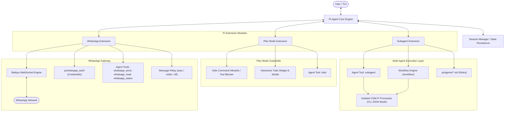

# Pi Agent: Plan Mode, Subagents & WhatsApp Extensions

A modular extension suite for the **Pi agent framework**, equipping agents with read-only plan exploration, isolated child subagent delegation, automated workflow pipelines, and native WhatsApp messaging integration.

---

## Table of Contents

- [Overview](#overview)
- [System Architecture](#system-architecture)
- [Key Features](#key-features)
  - [1. Plan Mode Extension](#1-plan-mode-extension)
  - [2. Subagent & Workflow Pipeline Extension](#2-subagent--workflow-pipeline-extension)
  - [3. WhatsApp Integration Extension](#3-whatsapp-integration-extension)
- [Installation & Quickstart](#installation--quickstart)
  - [Prerequisites](#prerequisites)
  - [Setup](#setup)
  - [Starting Pi](#starting-pi)
- [User Guide](#user-guide)
  - [Plan Mode & Todo Tracking](#plan-mode--todo-tracking)
  - [Subagent Delegation & Roles](#subagent-delegation--roles)
  - [Multi-Agent Workflow Pipelines](#multi-agent-workflow-pipelines)
  - [Workflow Pipeline vs Dynamic Subagents](#workflow-pipeline-vs-dynamic-subagents)
  - [WhatsApp Pairing & Messaging](#whatsapp-pairing--messaging)
- [Agent Tools Reference (LLM API)](#agent-tools-reference-llm-api)
- [Commands & Shortcuts Reference](#commands--shortcuts-reference)
- [Directory Structure](#directory-structure)
- [Extension Development & Custom Roles](#extension-development--custom-roles)
- [Security & Persistence](#security--persistence)

---

## Overview

This repository extends the Pi coding agent with three enterprise-grade extension modules:

1. **Plan Mode (`plan-mode`)**: An interactive, safe exploration mode where file editing tools are locked and terminal commands are constrained to safe read-only inspection. Plans are transformed into a live, tool-tracked checklist.
2. **Subagents & Workflow Pipelines (`subagent`)**: A multi-agent execution layer capable of spinning up isolated child `pi` processes with private context windows, supporting both autonomous dynamic delegations and structured pipeline sequences (`workflow.json`).
3. **WhatsApp Gateway (`whatsapp-pi`)**: Direct multi-device WhatsApp connectivity powered by [WhiskeySockets/Baileys](https://github.com/WhiskeySockets/Baileys), featuring ASCII/TUI QR pairing, media attachments, and configurable message relaying.

---

## System Architecture



---

## Key Features

### 1. Plan Mode Extension
- **Read-Only Exploration**: Built-in editing tools (`edit`, `write`) are temporarily disabled to prevent unintentional code modifications while investigating.
- **Safe Command Allowlist**: Restricts `bash` command execution to read-only tools (`cat`, `head`, `tail`, `grep`, `find`, `rg`, `ls`, `git status`, `git diff`, `git log`, etc.) while intercepting and blocking write operations (`rm`, `mv`, `git commit`, `npm install`, etc.).
- **Plan Extraction & Approval**: Automatically extracts numbered steps from markdown `Plan:` sections in LLM responses and prompts the user for action:
  - *Execute the plan (track progress)*
  - *Stay in plan mode*
  - *Refine the plan*
- **Strictly Tool-Driven Execution**: Todo items are updated exclusively via the registered `todo` tool (`start`, `done`, `add`, `set`, etc.).
- **Live Checklist Widget**: Real-time TUI widget above the prompt editor displaying task progression (`☑` completed, `▶` in progress, `☐` pending).
- **Status Bar Indicator**: Real-time progress display in the footer (e.g. `📋 2/5 (40%)`).
- **Interactive Todo Overlay**: Dedicated `/todos` overlay modal for full checklist inspection.

### 2. Subagent & Workflow Pipeline Extension
- **Isolated Child Processes**: Delegates sub-tasks to child `pi` processes (`pi --mode json`) running in separate context windows with their own session files.
- **Dynamic Subagent Tool (`subagent`)**: The LLM autonomously triggers subagents and specifies specialist roles (`planner`, `worker`), tasks, and extra instructions.
- **Plan Mode Synchronization**: Link subagent calls directly to plan-mode todo steps; when a subagent starts or finishes, the linked step status updates automatically.
- **Specialist Roles Registry**: Discovers markdown definitions from `.pi/agents/*.md` (e.g., `planner.md`, `worker.md`).
- **Transcript Switching**: Seamlessly jump to a child subagent's session transcript (`/sub-switch`) and return to parent context (`/sub-return`).
- **Deterministic Workflow Pipelines**: Execute linear multi-agent chains configured via `workflow.json` (e.g., `planner → worker`) with output chaining.

### 3. WhatsApp Integration Extension
- **Baileys WebSocket Engine**: Multi-device WhatsApp Web connectivity via `@whiskeysockets/baileys`.
- **Flexible Pairing**: Scan QR codes directly in the terminal log or launch a full-screen interactive TUI modal (`/whatsapp qr`).
- **Agent Tools**: Tools for sending text/media (`whatsapp_send`), reading conversation histories (`whatsapp_read`), checking health (`whatsapp_status`), and resetting credentials (`whatsapp_clear`).
- **Media Attachments**: Send images, PDFs, documents, audio clips, and videos directly from local disk.
- **Configurable Relaying**:
  - `auto`: Ingests incoming WhatsApp messages directly into the agent context loop to enable conversational agent interaction.
  - `notify`: Non-intrusive toast notification for new messages.
  - `off`: Silently stores messages in the history buffer.
- **Status Bar Indicator**: Live footer status (`🟢 WA: connected`, `🟡 WA: connecting`, `▲ WA: scan QR`, `⚪ WA: offline`).

---

## Installation & Quickstart

### Prerequisites
- Node.js 18 or higher
- The `pi` CLI binary installed and available in your `PATH`

### Setup

1. **Clone the repository**:
   ```bash
   git clone https://github.com/jjkwiee1031/pi-plan-subagent-extension.git
   cd pi-plan-subagent-extension
   ```

2. **Install dependencies**:
   ```bash
   npm install
   ```

3. **Verify directory structure**:
   ```bash
   # Verify extension directories exist
   ls -la .pi/extensions/
   # Should list: plan-mode/  subagent/  whatsapp-pi/

   # Verify specialist agent templates exist
   ls -la .pi/agents/
   # Should list: planner.md  worker.md
   ```

### Starting Pi

- **Standard Launch** (Subagent & Plan-mode loaded):
  ```bash
  pi
  ```

- **Launch Directly into Plan Mode**:
  ```bash
  pi --plan "Audit the codebase and draft a refactoring strategy"
  ```

- **Launch with WhatsApp Auto-Connect & Auto-Relay**:
  ```bash
  pi --whatsapp --whatsapp-relay auto
  ```

- **Combine All Features**:
  ```bash
  pi --plan --whatsapp
  ```

---

## User Guide

### Plan Mode & Todo Tracking

#### Toggling Plan Mode
You can toggle plan mode on and off interactively at any time:
- Via command: `/plan on` or `/plan off` (or toggle with `/plan`)
- Via shortcut: Press `Ctrl+Alt+P`
- Clear plan state: `/plan clear` (or `/plan reset`)

#### Managing Todos Manually
```bash
/todos              # Open interactive full-screen Todo modal
/todos done 2       # Mark step #2 as completed
/todos start 3      # Mark step #3 as in progress
/todos add "Audit"  # Append a new step to the active plan
/todos clear        # Clear all active todos
```

#### Plan Mode Allowed vs Blocked Commands

| Category | Allowed Commands | Blocked Commands |
|---|---|---|
| **File Inspection** | `cat`, `head`, `tail`, `less`, `more`, `bat` | `rm`, `mv`, `cp`, `touch`, `mkdir`, `rmdir` |
| **Search & Discovery** | `grep`, `rg`, `find`, `fd`, `awk`, `sed -n` | File redirects (`>`, `>>`, `tee`) |
| **Directory & Info** | `ls`, `pwd`, `tree`, `stat`, `file`, `du`, `df` | `chmod`, `chown` |
| **Git Operations** | `git status`, `git log`, `git diff`, `git branch`, `git show` | `git add`, `git commit`, `git push`, `git checkout`, `git reset` |
| **Package Management** | `npm list`, `yarn list`, `pip list` | `npm install`, `npm uninstall`, `yarn add`, `pip install` |
| **System Operations** | `uname`, `whoami`, `date`, `node -v` | `sudo`, `kill`, `shutdown`, `reboot`, `systemctl` |

---

### Subagent Delegation & Roles

Subagents run inside child `pi` processes with separate memory and session files, preventing context overflow in complex workflows.

#### Specialist Roles
Specialist roles are defined as markdown files in `.pi/agents/*.md`:
- **`planner`** (`.pi/agents/planner.md`): Focuses on architecture analysis and breaking tasks down into structured action items.
- **`worker`** (`.pi/agents/worker.md`): General-purpose specialist with full tool capabilities.

#### Interactive Subagent Commands
```bash
/subagent                             # Prompt for a task and spawn a sub-agent turn
/subagent Run security audit on auth  # Spawn worker sub-agent with given task
/subagent planner Draft migration plan# Spawn specialist 'planner' subagent
/subagent roles                       # List all available agent roles
/subagent list                        # List active and completed delegations
/subagent clear                       # Reset delegation history
/sub-switch #1                        # Switch view to subagent #1 session transcript
/sub-return                           # Return to parent agent session
```

*Keyboard Shortcut*: `Ctrl+Alt+S` opens the subagent prompt immediately.

---

### Multi-Agent Workflow Pipelines

Pipelines define structured, sequential multi-agent chains where the output of one agent automatically feeds into the next.

#### Pipeline Configuration (`workflow.json`)
```json
{
  "agents": ["planner", "worker"]
}
```

#### Running Pipelines
```bash
/workflow load workflow.json
/workflow run "Implement user authentication with JWT"
```

1. Pi launches the `planner` subagent to analyze requirements and generate an execution blueprint.
2. The blueprint is passed to the `worker` subagent to perform the implementation.
3. The final synthesized result is presented back to the parent session.

---

### Workflow Pipeline vs Dynamic Subagents

| Dimension | Workflow Pipeline (`/workflow`) | Dynamic Subagents (`subagent` tool) |
|---|---|---|
| **Structure** | Fixed / Deterministic: Defined upfront (e.g. `workflow.json`). | Dynamic / Autonomous: Decided on-the-fly by the LLM. |
| **Execution** | Sequential: Output of Step N feeds into Step N+1. | Parallel or Sequential: Main agent can spawn concurrent workers. |
| **Context Topology** | Chained Assembly Line: Pipe forward through steps. | Hub & Spoke: All results flow back to the main coordinator. |
| **Ideal For** | Standardized development lifecycles (`planner → worker`). | Unpredictable tasks, multi-faceted research, deep debugging. |

---

### WhatsApp Pairing & Messaging

#### Pairing Walkthrough
1. Start Pi and run:
   ```text
   /whatsapp connect
   ```
2. A QR code will display in your terminal. You can also view the high-contrast TUI overlay modal:
   ```text
   /whatsapp qr
   ```
3. Open **WhatsApp** on your phone > **Settings** (or `⋮`) > **Linked Devices** > **Link a Device**.
4. Scan the QR code.
5. The status bar will transition to: `🟢 WA: connected (+<phone>)`. Credentials are saved to `.pi/whatsapp_auth/`.

#### WhatsApp Slash Commands

| Command | Description |
|---|---|
| `/whatsapp connect` | Initialize connection and display QR code |
| `/whatsapp qr` | View full-screen interactive QR modal |
| `/whatsapp status` | Display connection status, phone number, and message count |
| `/whatsapp send <phone> <message>` | Send a message directly from the command bar |
| `/whatsapp messages [limit]` | Print recent incoming and outgoing messages |
| `/whatsapp mode [notify\|auto\|off]` | Switch incoming message relaying mode |
| `/whatsapp disconnect` | Disconnect active WebSocket connection |
| `/whatsapp logout` | Disconnect and clear credentials from disk |
| `/whatsapp clear` | Disconnect, delete credentials, and wipe message history |

---

## Agent Tools Reference (LLM API)

### 1. `todo` (Plan Mode)
The exclusive tool for modifying the active execution checklist:
```typescript
{
  action: "list" | "add" | "start" | "done" | "toggle" | "set" | "clear",
  id?: number,        // Step number / ID
  text?: string,      // Task description (for 'add')
  todos?: string[]    // Array of step descriptions (for 'set')
}
```

*Example: Initializing a plan*:
```json
{
  "action": "set",
  "todos": [
    "Inspect database schema in models/",
    "Create migration script for user status",
    "Run unit tests and verify backwards compatibility"
  ]
}
```

---

### 2. `subagent` (Delegation)
Spawns an isolated child agent process to handle a task:
```typescript
{
  action: "start" | "done" | "list" | "delegate",
  subagentId?: number,
  step?: number,        // Optional: Plan-mode step to sync status with
  role?: string,        // Specialist role: "planner" | "worker"
  task?: string,        // Task description
  instructions?: string // Additional guidelines
}
```

*Example: Starting a delegated task linked to Plan Step 2*:
```json
{
  "action": "start",
  "subagentId": 1,
  "role": "worker",
  "step": 2,
  "task": "Implement password reset token generation",
  "instructions": "Use crypto.randomBytes(32) and save expiry to 1 hour."
}
```

---

### 3. `whatsapp_send`
Sends text messages and local media files to a phone number or group:
```typescript
{
  to: string,           // Phone number (+123456789), JID, or group JID
  message?: string,     // Text body
  mediaPath?: string,   // Local absolute or relative path to media
  caption?: string      // Media caption
}
```

---

### 4. `whatsapp_read`
Reads message history from stored conversations:
```typescript
{
  chat?: string,        // Filter by phone number or JID
  limit?: number,       // Number of messages (default: 20)
  incomingOnly?: boolean// Retrieve only incoming messages
}
```

---

### 5. `whatsapp_status` & `whatsapp_clear`
- `whatsapp_status`: Returns connection state, user JID, and message statistics.
- `whatsapp_clear`: Logs out and wipes local credential files.

---

## Commands & Shortcuts Reference

### Slash Commands
| Command | Extension | Description |
|---|---|---|
| `/plan [on\|off\|clear]` | Plan Mode | Toggle or set plan mode status |
| `/todos [done\|start\|add\|clear]` | Plan Mode | Inspect or edit plan checklist |
| `/subagent [role] <task>` | Subagent | Spawn a child specialist turn |
| `/subagent list` | Subagent | Show active subagent delegations |
| `/subagent roles` | Subagent | List available specialist templates |
| `/sub-switch <#id\|role>` | Subagent | View a subagent's session transcript |
| `/sub-return` | Subagent | Return to parent session transcript |
| `/workflow load <file>` | Subagent | Load multi-agent workflow file |
| `/workflow run <task>` | Subagent | Execute sequential workflow |
| `/whatsapp connect` | WhatsApp | Connect and generate pairing QR |
| `/whatsapp qr` | WhatsApp | Open QR pairing modal |
| `/whatsapp status` | WhatsApp | Display connection & phone info |
| `/whatsapp send <to> <msg>` | WhatsApp | Send WhatsApp message from CLI |
| `/whatsapp mode <mode>` | WhatsApp | Set incoming relay (`notify`, `auto`, `off`) |
| `/whatsapp logout` | WhatsApp | Disconnect and clear auth credentials |

### Keyboard Shortcuts
| Shortcut | Action |
|---|---|
| `Ctrl+Alt+P` | Toggle Plan Mode |
| `Ctrl+Alt+S` | Open Subagent Task Prompt |

### CLI Flags
| Flag | Description |
|---|---|
| `--plan` | Start Pi directly in Plan Mode |
| `--whatsapp` | Auto-connect WhatsApp on startup |
| `--whatsapp-relay <mode>` | Set incoming message relay behavior (`notify`, `auto`, `off`) |

---

## Directory Structure

```
.
├── package.json                   # Project manifest & WhatsApp dependencies
├── workflow.json                  # Multi-agent workflow definition
├── .gitignore                     # Git ignore rules (protects auth credentials)
├── .pi/
│   ├── agents/                    # Specialist agent templates
│   │   ├── planner.md             # Planning specialist role definition
│   │   └── worker.md              # Implementation worker role definition
│   ├── extensions/
│   │   ├── plan-mode/             # Plan Mode Extension
│   │   │   ├── index.ts           # Extension entrypoint, tools & commands
│   │   │   ├── utils.ts           # Command validation allowlist & types
│   │   │   └── README.md          # Plan mode module documentation
│   │   ├── subagent/              # Subagent & Workflow Extension
│   │   │   ├── index.ts           # Extension entrypoint & delegation handling
│   │   │   ├── process.ts         # Child process spawning & stdout streaming
│   │   │   ├── workflow.ts        # Pipeline workflow engine
│   │   │   ├── components.ts      # Interactive TUI modal components
│   │   │   ├── utils.ts           # State helpers & agent discovery
│   │   │   └── README.md          # Subagent module documentation
│   │   └── whatsapp-pi/           # WhatsApp Integration Extension
│   │       ├── index.ts           # Extension entrypoint & slash commands
│   │       ├── client.ts          # Baileys client wrapper & event handling
│   │       ├── components.ts      # Interactive QR & TUI modals
│   │       ├── utils.ts           # JID parsing, parameter schemas & helpers
│   │       └── README.md          # WhatsApp module documentation
│   └── whatsapp_auth/             # WhatsApp session keys (git-ignored)
└── README.md                      # Project documentation
```

---

## Extension Development & Custom Roles

### Adding a Custom Specialist Agent
Create a markdown file in `.pi/agents/<role-name>.md`:

```markdown
---
name: reviewer
description: Code quality, security, and test verification specialist
---
## Role
You are a code review specialist. Inspect diffs and ensure tests cover edge cases.

## Rules
- Verify test coverage before approving changes.
- Check for security vulnerabilities and injection flaws.
- Provide actionable recommendations with line references.
```

The new role is immediately discoverable via `/subagent roles` and can be invoked directly:
```bash
/subagent reviewer "Verify the auth middleware changes"
```

### Developing a New Pi Extension
1. Create a folder in `.pi/extensions/<my-extension>/`.
2. Add an `index.ts` exporting default function `(pi: ExtensionAPI): void`.
3. Register tools with `pi.registerTool()`, commands with `pi.registerCommand()`, and shortcuts with `pi.registerShortcut()`.
4. Tap into session lifecycle hooks: `session_start`, `before_agent_start`, `agent_end`, and `tool_call`.

---

## Security & Persistence

- **WhatsApp Credentials**: Saved in `.pi/whatsapp_auth/`. This directory is included in `.gitignore` by default. Never commit credentials to source control.
- **Child Subagent Isolation**: Subagents run as isolated processes with their own transient context and session records, preventing sensitive parent prompt pollution.
- **Execution Safety**: Plan mode intercepts all bash calls against an allowlist to prevent accidental destructive system operations during analysis.
- **Session Continuity**: Delegations, plan todo checklists, and connection configurations survive session interruptions and persist across pauses and resumes.
